# Skateboarding Robot Project
Senior capstone project for ME 495: Robot Design Studio, Northwestern University, Winter and Spring 2020.

## Overview
This is a repository of the code that was used to program the Tiva microcontroller and simulate the robot tricks for the Skateboarding Team of Robot Design Studio 2020. 

## Background
For the academic year of 2019-2020, RDS projects were themed around olympic sports, and this project was inspired by the new olympic sport of skateboarding. 

The goal of this project was to build a skateboarding robot that could accomplish three tricks of choice. The design was constrained in two ways: 1) the robot could only be actuated with two degrees of freedom and 2) the skateboard wheels could not be actuated. 

**Due to the pandemic, the project had to pivot from a physical robot to a simulated one halfway during the course.**

The three tricks that the robot performs are:
1. Dropping-in: a trick with which a skateboarder starts skating a half-pipe by dropping into it from the coping instead of starting from the bottom. For the robot, this meant moving the horizontal component of the COM from outside the half-pipe to past the coping.

   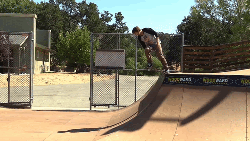

2. Pumping: a technique used to accelerate without the rider's feet leaving the board. For the robot, this meant rapidly moving the vertical component of the COM down when accelerating down the half-pipe and up when decelerating up it. This was definitely the hardest trick to perform, as it required the robot to have considerable top mass and motor power to achieve this high acceleration.

   

3. The "manual": essentially is a skateboarding wheelie. For the robot, this meant controlling the horizontal component of the COM to be directly above the hind wheel of the skateboard. We used LQR control.

   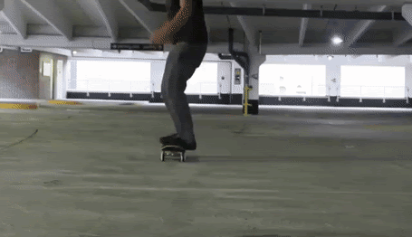

## Mechanical Design (pre-COVID)
Much of Winter 2020 was spent designing the mechanical components of the robot. The overall design had two revolute joints and resembled an inverted double pendulum, and provided a superior ability to control the robot's center of mass when compared to designs that used linear or decoupled rotational actuators. Most of the robot's weight was concentrated at the top (the pendulum bob) in order to provide the necessary momentum to perform the tricks when manipulated. This weight came from two powerful motors (which rotated the two joints using belt drives) and two motor controllers. Fittingly, the robot was nicknamed "Thora" due to its likeness to Thor's hammer.

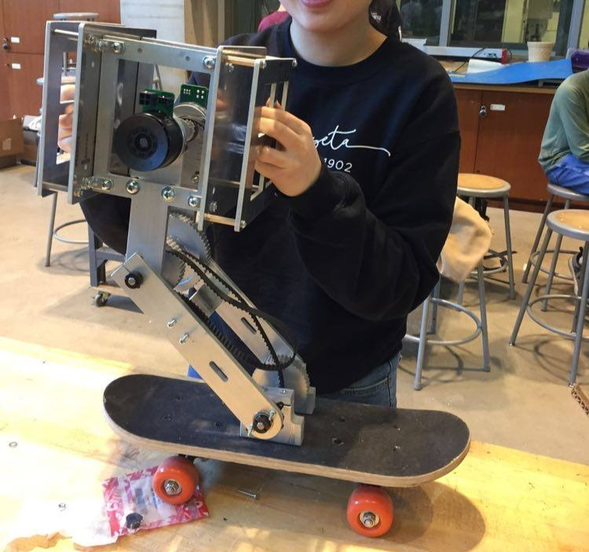 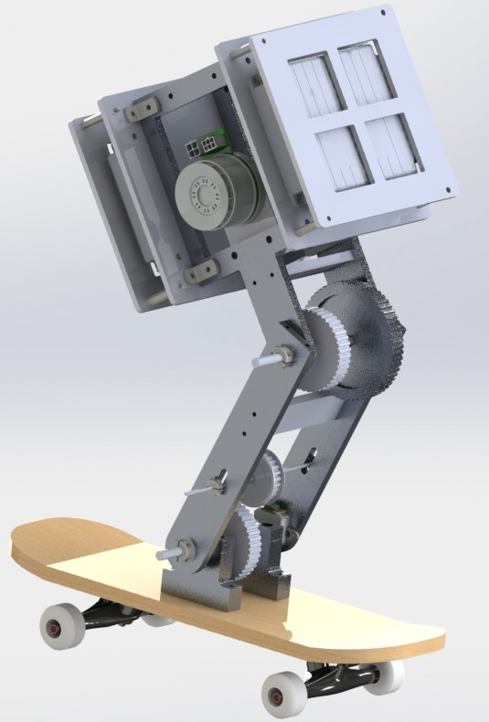

## Electronics (pre-COVID)
### Microcontroller
The Tiva TM4C123GH6PM Microcontroller formed the brains of the real-life robot. It offers a 80 MHz Cortex-M with FPU, a variety of integrated memories, and multiple programmable GPIO. The plan for the real-life robot was for the Tiva to communicate with sensors and motor controllers, issuing commands for the different states of the skateboarding operation. The `tiva_roboteq` folder contains code for communication between the Tiva and the two Roboteq controllers.

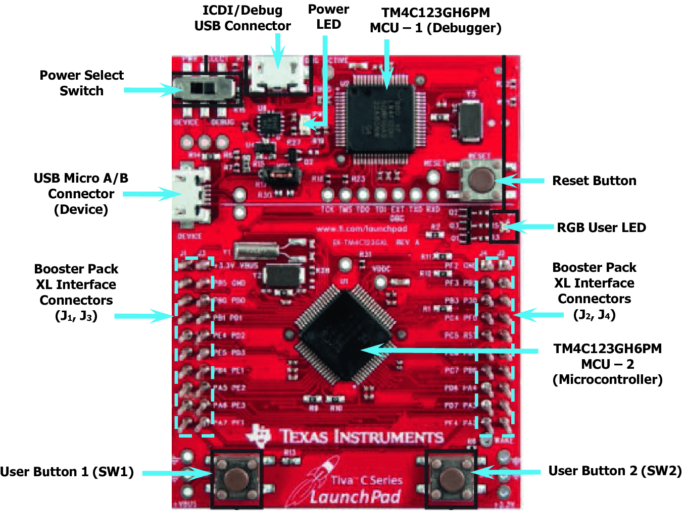

### Motors and Motor Controllers
Two Maxon EC 60 flat Ø60 mm brushless motors would be used to actuate the two degrees of freedom of the robot. These motors had a max power of 200 W and were equipped with hall sensors. They could provide the 4.05 Nm max torque (after a 4:1 gearing ratio) and take in the ~60 A max current required for the pumping operation. See the `motor_analysis` folder for torque and speed calculations.

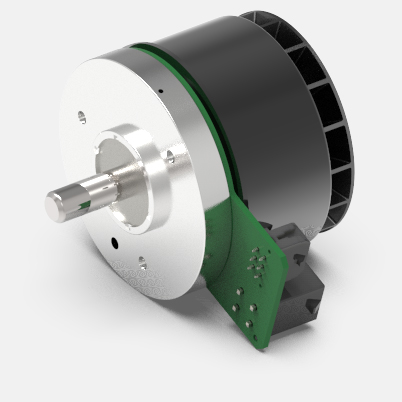

Two Roboteq MBL1660 brushless DC motor controllers would be use to control the powerful motors. They provide numerous advanced control modes — which include torque and speed control — but its position control modes (Closed Loop Position Relative, Closed Loop Count Position, Closed Loop Position Tracking) would've been used for this project.
 
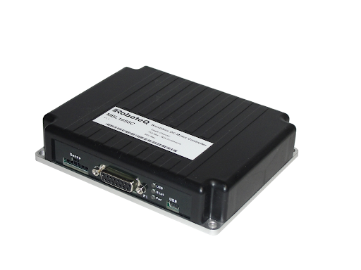

### Sensors
An IMU (inertial measurement unit) would provide the robot with speed, acceleration, and orientation information. This information was necessary to detect the robot's position in the ramp during pumping and its tilt during the manual, among other reasons. Two IMU options were considered — the STMicroelectronics LSM9DS1 (in a Sparkfun board) and the Bosch BNO055 (in a Pololu board). 

The ST IMU was implemented first. Code that reads IMU data from the Sparkfun board into the Tiva using I2C commucation can be found in the `imu_sparkfun` folder.
 

The Bosch IMU was later selected to replace the ST IMU due to its superior sensor fusion, but its implementation fell short as the pandemic hit. Bosch drivers can be found in the `bno_drivers` folder.
 
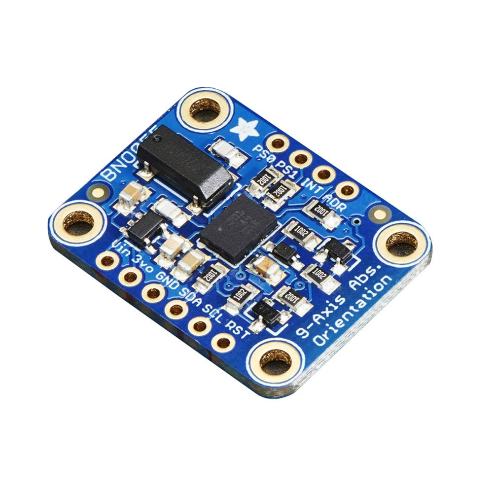

A CUI AMT11 incremental encoder was attached to each motor shaft and would provide information to the corresponding Roboteq controller for position control. The encoders could also provide this information to the Tiva (and code for this can be found in the `encoder` folder) but this was deemed unnecessary as the Roboteq would be in charge of the entire position control loop.
 
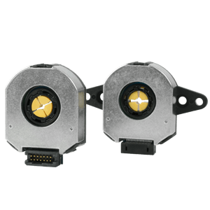

## Simulation and Trick Demos (post-COVID)
Even though the real-life robot could not be used after the pandemic hit, its mechanical properties were used to model a dynamic system in MATLAB and simulate the tricks. See the `simulation` folder for all the simulation code and the [simulation README](simulation/README.md) for a more in-depth look at how each trick was performed.
1. Dropping-in:

   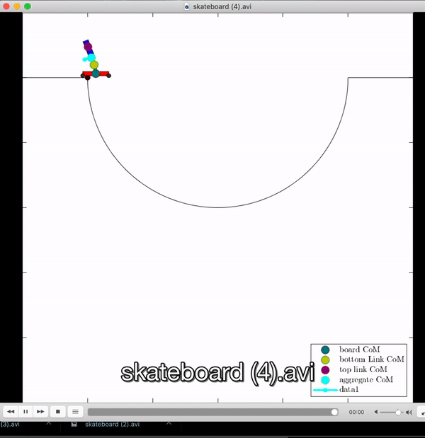
   
2. Pumping: 

   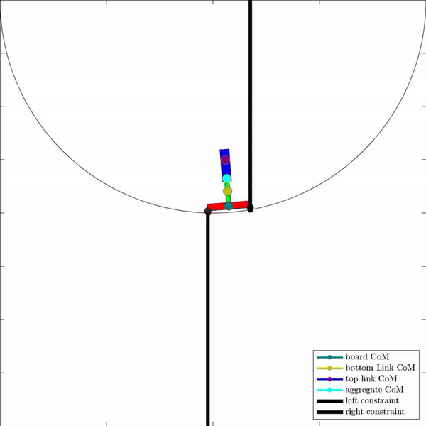
   
3. Manual:

   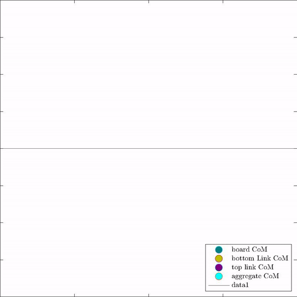
   
## Usage
For Tiva code, each `Makefile` must be edited to fit a user's computer. See [Tiva make README](hello_world/README.md) for instructions on how to compile code.

All MATLAB codes have options for all three three tricks but will only run the specified one correctly (correct gains, will plot for the specified trick).

See instructions on how to run simulations in the [simulation README](simulation/README.md).

## Folder Descriptions
- `accelerometer`: Pololu LSM303D accelerometer data retrieval.
- `bno_drivers`: Bosch Sensortec BNO055 sensor driver library.
- `encoder`: communication between CUI AMT11 encoder and Tiva.
- `hello_world`: tests Tiva communication. Includes the [Tiva make README](hello_world/README.md).
- `imu_sparkfun`: streams data from SparkFun IMU (LSM9DS1).
- `motor_analysis`: MATLAB code for motor calculations.
- `pid_controller_on_tiva`: simulating PID control of a rotary mass-spring-damper system using Simulink and Tiva microcontroller.
- `simulation`: MATLAB code that runs a simulations of the skateboard robot. Includes the [simulation README](simulation/README.md)
- `tiva_roboteq`: code that interfaces between the Tiva microcontroller and Roboteq controller for position commands.
