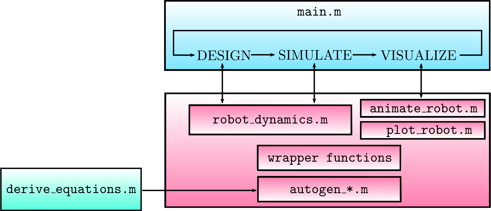

# Skateboard Simulation

## Usage
### MATLAB Dependencies
- Optimization Toolbox
- Control System Toolbox

### Overview
Application entry point is `main.m`, which calls (through wrapper functions) dynamics-related functions that are automatically generated by running `derive_equations.mlx`. That means `derive_equations.mlx` has to be run before `main.m` is run for the first time. The workflow is depicted below.



`derive_equations.mlx` uses symbolic computation to generate the state-space dynamics of the skateboard robot, which are then exported as MATLAB functions (e.g., `autogen_drift_vector_field.m` and `autogen_control_vector_field.m`).

### Autogenerated functions and wrappers
`derive_equations.mlx` uses `matlabFunction(variable,'File','filename')` extensively, to convert symbolic expressions to MATLAB functions that can be evaluated numerically.
However, these functions often require many input arguments.
For example, the autogenerated function that computes the conservative forces looks like this:

```Matlab
function G_q = autogen_conservative_forces(boardMass,boardTheta,boardHeight,bottomLinkRCoM,bottomLinkMass,bottomLinkTheta,bottomLinkHeight,g,topLinkRCoM,topLinkMass,topLinkTheta)
...
```
All those inputs arguments should not be supplied individually. Instead, they can be grouped into two categories:
- Robot state: `x = [boardX; boardY; boardTheta; bottomLinkTheta; topLinkTheta; boardDX; boardDY; boardDTheta; bottomLinkDTheta; topLinkDTheta]`.
- Parameters: literally everything else in the example above.

#### MATLAB structs and parsers
In addition to physical parameters (mass, length, etc) that anchor the dynamics in reality, there are many other parameters relevant to simulation, such as timestep size, appearance of the skateboard robot, etc. All the parameters are grouped into a struct called `params`, which is generated by calling `init_params.m`. This struct gets passed around throughout the simulation, and saves from having to worry about the order in which input arguments are supplied.

Another way to avoid input argument order-dependency (a trademark of brittle code) is to use Name-Value pairs. Name-Value pairs rely on an "input parser"; see `plot_robot.m` and `animate_robot.m` to see how this works.

### Steps
1. Run `derive_equations.mlx` to generate all autogenerated MATLAB files (this step must only be done if `derive_equations.mlx` is changed).
2. Run `main.m` and specify which trick to perform. This file calls all other function files, including `animate_robot.m` which outputs an `output.avi` video of the simulated skateboard performing the trick.

## File Descriptions
### Equation Generation
- `autogen_com_velocities.m`: calculates center of mass velocities in x and y directions of bottom and top links of robot.
- `autogen_conservative_forces.m`: calculates `G_q`, the matrix of conservative forces of robot.
- `autogen_constraint_derivatives_flat.m` & `constraint_derivatives_flat.m`: computes the constraint jacobian and hessians for the robot in the flat stage.
- `autogen_constraint_derivatives_ramp.m` & `constraint_derivatives_ramp.m`: computes the constraint jacobian and hessians for the robot in the ramp stage.
- `autogen_constraint_derivatives_ramp_lip.m` & `constraint_derivatives_ramp_lip.m`: computes the constraint jacobian and hessians for the robot on the ramp's lip.
- `autogen_constraints_flat.m` & `constraints_flat.m`: computes the constraint forces of the robot in the flat stage.
- `autogen_constraints_ramp.m` & `constraints_ramp.m`: computes the constraint forces of the robot in the ramp stage.
- `autogen_constraints_ramp_lip.m` & `constraints_ramp_lip.m`: computes the constraint forces of the robot in the ramp's lip.
- `autogen_derivative_conservative_forces.m`: calculates the jacobian of `G_q`, the matrix of conservative forces of robot.
- `autogen_fk_wheels.m` & `wheel_coordinates`: computes the locations of the wheels of the skateboard.
- `autogen_fwd_kin.m` & `fwd_kin.m`: computes the forward kinematics for three points on the robot.
- `autogen_h_eom.m` & `h_eom.m`: computes the Hessian `H` of the robot.
- `autogen_inverse_mass_matrix.m` & `inv_mass_matrix.m`: computes the inverse of the mass matrix of the robot.
- `autogen_mass_matrix.m` & `mass_matrix.m`: computes the mass matrix of the robot.
- `autogen_total_energy.m` & `total_energy.m`: computes the total energy of the robot.
- `autogen_wheel_velocities.m` & `wheel_velocities.m`: computes the velocities of the wheels of the skateboard.
- `derive_equations.mlx`: live script file for the generation of equations that describe the kinematics, dynamics, and energy of the robot. Generates all `autogen_*.m` files.

### Plotting and Animation
- `animate_robot.m`: animates the robot according to a list of configurations over time.
- `circle.m`: used for plotting a circle in `plot_robot.m`.
- `track.m`: computes the 2x1 vectors position, tangent and normal for a semicircular track.
- `plot_robot.m`: plots the robot in its current configuration.

### Initialization
- `init_env.m`: configures graphics and LaTeX properties.
- `init_params.m`: initializes the values of many parameters, such as parameters in the system dynamics, parameters that relate to simulating the system forward in time, and parametes that relate to visualization/animation.

### Main File
- `main.m`: application entry point. Main file to run in this project.

### Controls
- `lqr_manual.m`: computes the LQR gains that keep robot in place during the manual trick.
- `pid_idle.m`: computes the controls in order to maintain a robot's position steady while it moves along the ramp.
- `pid_pumping.m`: computes the controls for pumping on the ramp.

## Deriving Equations
